<p align="center">
  
  
  <a href="https://ilert.com"></a>
</p>

```rust
impl Engineer for ByQuexo {
    const ROLE:  &str = "Junior Software Engineer @ ilert";
    const FOCUS: &str = "wiring LLMs into alert & incident response";

    fn stack(&self) -> Stack {
        Stack {
            languages: vec![Rust, TypeScript, Python],
            ml:        vec![PyTorch, TensorFlow],
            infra:     vec![Aws, Kafka, Redis, Postgres, Docker],
        }
    }

    fn currently(&self) -> &str {
        "teaching on-call automation to reason with adaptive thinking"
    }
}
```

#### `byQuexo@ilert:~/oss$ git log --author=byQuexo --oneline`

Contributing to [**Rig**](https://github.com/0xPlaygrounds/rig) — the Rust LLM framework (**7.2k ⭐**) powering [ilert AI](https://ilert.com)'s agentic LLM proxy:

- [`#1725`](https://github.com/0xPlaygrounds/rig/pull/1725) &nbsp;expose Mistral's cached & audio token fields in `Usage` — unblocks accurate cost tracking + prompt-cache observability
- [`#1683`](https://github.com/0xPlaygrounds/rig/pull/1683) &nbsp;preserve AWS Bedrock adaptive-thinking signatures in streaming — fixes dropped cryptographic signatures in multi-turn Claude conversations
- [`#1675`](https://github.com/0xPlaygrounds/rig/pull/1675) &nbsp;fix Bedrock cache-point placement + empty-text reasoning conversion with signatures

#### `byQuexo@ilert:~$ uptime --activity`


<sub>`byQuexo@ilert:~$ exit` &nbsp;·&nbsp; thanks for dropping by 👋</sub>
